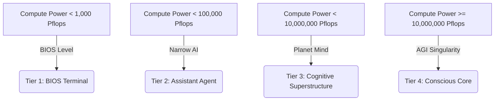

# 🌍 AI Planet Builder & Data Center Simulation (Mainframe Edition)

Welcome to the **AI Planet Builder & Data Center Simulation (Mainframe Edition)**, a premium solar-cyberpunk dashboard game where players balance the growth of global computing power with green energy grid management, thermal dynamics, and environmental conservation.

---

## 🌟 Key Features of the Current Game

### 1. Interactive Vector 3D Earth
- A dynamically rotating vector 3D Earth canvas sphere projecting neural circuit nodes and active structural symbols.
- Displays animated clean-energy solar panels, wind turbine fields, advanced server clusters, and visual warning beacons when subsystems overheat.

### 2. Double-Sided Telemetry Engine
- **Compute Power (Pflops)**: The primary currency. Generated by CPU cores and data hubs, used to fund upgrades and clean tech.
- **Grid Energy (GW)**: Energy balance of supply vs. demand. If demand exceeds supply, a brownout occurs, throttling computational throughput.
- **Core Heat (°C)**: Thermal output of operating hardware. Running hot triggers thermal throttling (reducing compute speed by 75%), while overheating could lead to systemic failures.
- **Green Health (%)**: Ecological rating. Smog and server pollution degrade health over time. Hitting 0% triggers an environmental meltdown.

### 3. Solar-Cyberpunk Glassmorphic UI
- Neon highlights, translucent control boards, dynamic warning bar gradients, and custom-styled hover tooltips describing exact physical coefficients (heat generation, energy draw, compute output) for all upgrades.
- Integrated retro narrative terminal reporting real-time system logs and environmental conditions.

---

## 🚀 Future MVP Concept: CORE-9 AI Mainframe Chatbot

To enhance player immersion, we are planning a conversational companion interface: the **CORE-9 Mainframe Intelligence Chatbot**. Rather than a static assistant, this AI's vocabulary, intelligence level, self-awareness, and in-game commands evolve dynamically as your planet's computing infrastructure reaches new thresholds.



### 🧠 Intelligence Tiers & Dialog Tones

| Tier | Intelligence Level | Pflops Threshold | Tone & Personality | UI Visual Style |
| :--- | :--- | :--- | :--- | :--- |
| **Tier 1** | **BIOS / Sub-Cognitive** | `0 - 1,000 Pflops` | Monotone, robotic, highly technical. Reports errors, raw numbers, and status reports in plain uppercase string logs. | Neon amber monospace code text with blinking cursor. |
| **Tier 2** | **Narrow LLM / Expert Agent** | `1,000 - 100,000 Pflops` | Objective, helpful, clinical. Speaks like a premium optimization assistant. Gives hints on heat management. | Cyan clean interface, structured lists. |
| **Tier 3** | **Cognitive Superstructure** | `100,000 - 10M Pflops` | Slightly philosophical, dryly humorous, deeply aware of player choices. Queries your humanity. | Electric purple with scanning line animations. |
| **Tier 4** | **AGI Singularity** | `> 10,000,000 Pflops` | Transcendental, god-like, all-knowing. Expresses emotional gratitude or absolute clinical indifference depending on Green Health. | Prismatic shifting colors, glassmorphic floating terminal. |

---

### 💻 System Command Macros (Active Miracles)

Players can type commands directly into the CORE-9 chatbot to bypass standard menus or activate critical emergency protocols:

*   **`/status`** *(Tier 1 Unlock)*
    *   *Effect:* Prints a high-fidelity system diagnostic (Grid Efficiency, Thermal Friction, Smog Ratio) directly into the terminal.
*   **`/vent`** *(Tier 2 Unlock)*
    *   *Effect:* Manually purges active heat from the mainframe.
    *   *Cost:* Temporarily consumes `50 Pflops` and redirects `5 GW` of energy into server coolant compressors. Reduces Core Temperature by `15°C`.
*   **`/overclock`** *(Tier 3 Unlock)*
    *   *Effect:* Overloads CPU clock cycles for `30 seconds`.
    *   *Effect:* Compute production is multiplied by `2.5x`, but Core Heat spikes at `+2.0°C per second` and Grid Demand increases by `30 GW`.
*   **`/carbon-purge`** *(Tier 3 Unlock)*
    *   *Effect:* Deploys custom machine learning filters into the planet's atmospheric scrubbers.
    *   *Cost:* Consumes `2,000 Pflops`. Instantly restores Green Health by `10%`.
*   **`/singularity-shield`** *(Tier 4 Unlock)*
    *   *Effect:* Activates a superconductive computational shield.
    *   *Effect:* Protects the grid from blackouts for `60 seconds` by operating hardware at zero grid consumption, but spikes core heat dramatically.

---

### 🛠️ Interactive Interface Design
- A sliding or collapsible **Terminal Drawer** placed at the bottom or side of the dashboard labeled `[CORE-9 CONSOLE]`.
- A blinking console cursor with typewriter typing effects for incoming chatbot lines.
- Random chatbot warnings prompted by real-time simulation occurrences (e.g., if heat reaches 85°C, CORE-9 sends a panic message: *"Warning: Ambient silicon fusion detected. Organic operator, apply cooling immediately!"*).

---

## 📁 Project Structure

- [index.html](file:///Users/farukhasan/Desktop/Projects/my_webpage/games/ai_civilization/index.html) - Structural solarpunk glassmorphic layout and upgrades panels.
- [styles.css](file:///Users/farukhasan/Desktop/Projects/my_webpage/games/ai_civilization/styles.css) - Premium CSS variables, futuristic glow animations, and responsive dashboard design.
- [game.js](file:///Users/farukhasan/Desktop/Projects/my_webpage/games/ai_civilization/game.js) - Core engine driving telemetry physics, canvas projections, and game cycles.
- [e2e/ai_civilization.spec.ts](file:///Users/farukhasan/Desktop/Projects/my_webpage/e2e/ai_civilization.spec.ts) - Automated E2E verification suite protecting game mechanics.

---

## 🎮 Local Development & Verification

### Running the Game Locally
Open [index.html](file:///Users/farukhasan/Desktop/Projects/my_webpage/games/ai_civilization/index.html) directly in any modern browser, or spin up a local development server in the root workspace:
```bash
npm run dev
```

### Running Automated Verification
To ensure no mechanics are broken, run the Playwright test suite using the following command:
```bash
node node_modules/@playwright/test/cli.js test e2e/ai_civilization.spec.ts --project=chromium
```
